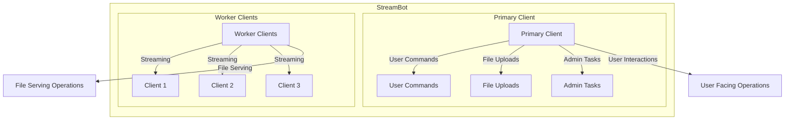
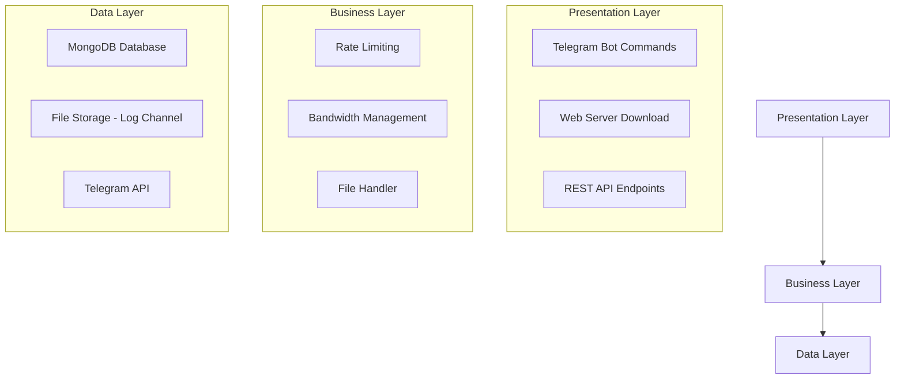
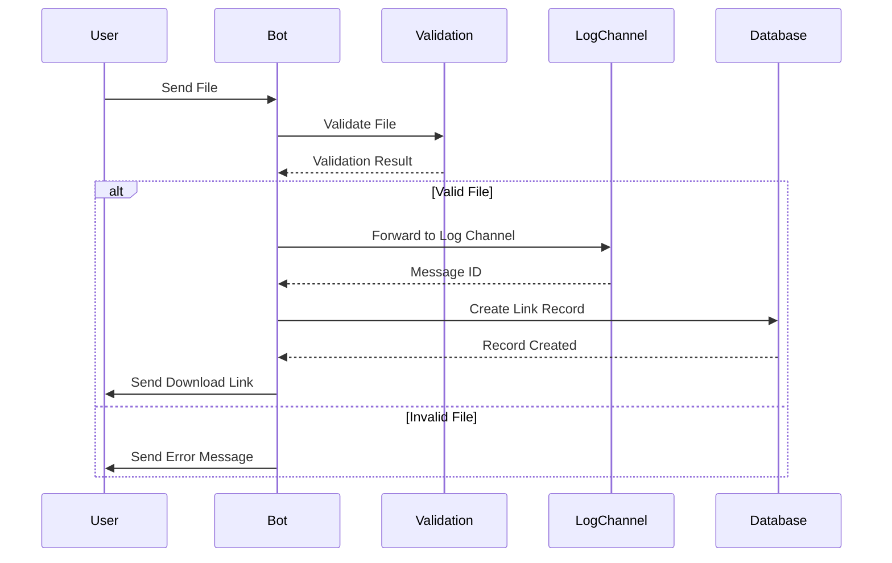
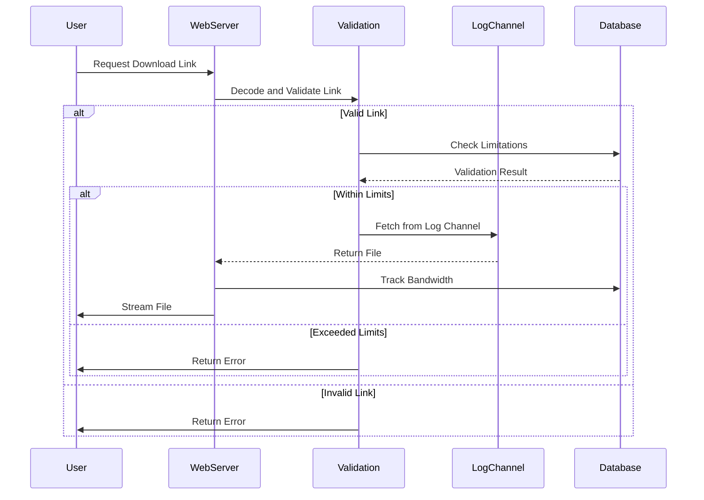
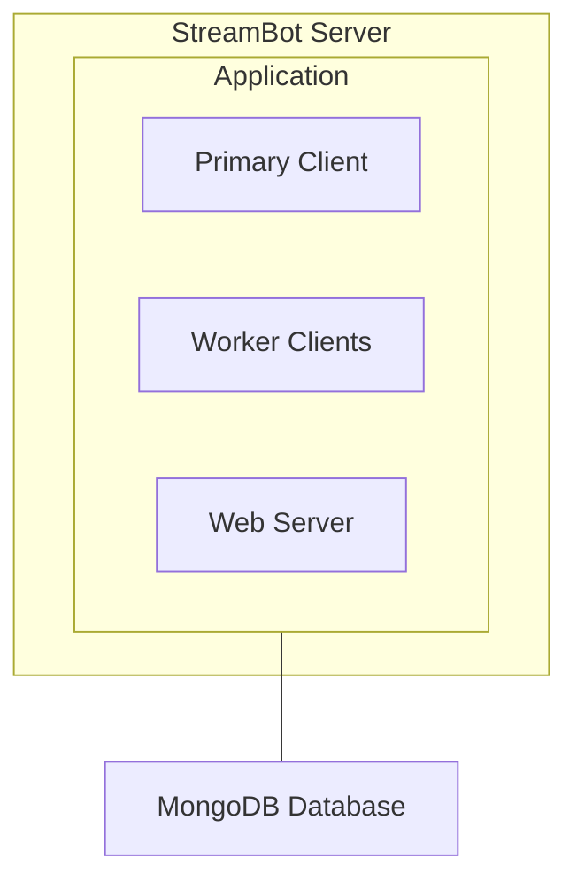
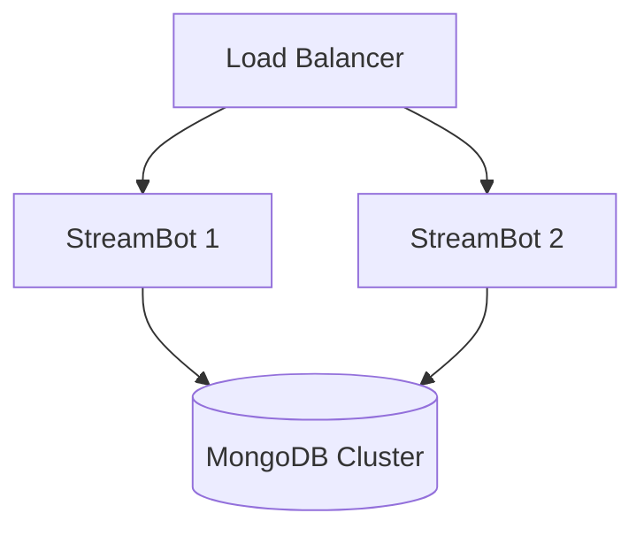

# Architecture Overview

StreamBot is built with a distributed architecture that employs a multi-client design pattern with clear separation of concerns for scalability, reliability, and maintainability.

## Multi-Client Architecture

StreamBot uses a primary client for user interactions and multiple worker clients for file streaming operations, providing load balancing and improved throughput.



### Primary Client
- Handles all user interactions and commands
- Manages file uploads and validation
- Processes administrative tasks and monitoring

### Worker Clients
- Dedicated to streaming operations
- Provide load balancing for downloads
- Improve overall system throughput

## Application Layers

The application follows a layered architecture for separation of concerns and maintainability.



### Presentation Layer
- **Telegram Bot**: User commands and interactions
- **Web Server**: File download functionality
- **REST API**: System monitoring and integration

### Business Layer
- **Rate Limiting**: Controls user access frequency
- **Bandwidth Management**: Monitors and limits data transfer
- **File Handler**: Processes and manages file operations

### Data Layer
- **MongoDB**: User data and application state
- **File Storage**: Uses Telegram channels for storage
- **Telegram API**: Core communication infrastructure

## Data Flow Diagrams

### File Upload Flow



### File Download Flow



## Component Details

### ClientManager (`client_manager.py`)

The ClientManager orchestrates multiple Telegram client instances for distributed workloads.

```python
class ClientManager:
    def __init__(self):
        self.primary_client = None  # Primary bot for user interactions
        self.worker_clients = []    # List of streaming-dedicated clients
        self._round_robin_index = 0 # Load balancer state
        self._lock = asyncio.Lock() # Thread-safe operations
```

**Key Features**:
- Round-robin load balancing for streaming
- Automatic client health monitoring
- Graceful startup/shutdown handling
- Connection recovery mechanisms

### Configuration Management (`config.py`)

Centralized configuration with environment variable validation.

**Features**:
- Type-safe environment variable loading
- Required/optional parameter validation
- Default value handling
- Sensitive data masking in logs

### Database Layer (`database/database.py`)

MongoDB operations for user and system management.

**Collections**:
- `users`: User registration and tracking
- `bandwidth_usage`: Monthly bandwidth monitoring

**Features**:
- Connection pooling
- Error handling and retry logic
- Efficient query patterns

### Web Server (`web/web.py`)

HTTP server for file downloads and API functionality.

**Features**:
- Range request support (partial downloads)
- CORS configuration
- Rate limiting integration
- Error handling and logging

## Utility Modules

### Rate Limiter (`utils/rate_limiter.py`)
- **Algorithm**: Sliding window with deque-based timestamp tracking
- **Features**: Per-user daily limits, thread-safe operations

### Bandwidth Manager (`utils/bandwidth.py`)
- **Algorithm**: Monthly rolling limits with auto-reset
- **Features**: Real-time tracking, MongoDB persistence

### Memory Manager (`utils/memory_manager.py`)
- **Purpose**: Memory leak prevention and monitoring
- **Features**: Periodic cleanup, usage tracking, garbage collection

### Stream Cleanup (`utils/stream_cleanup.py`)
- **Purpose**: HTTP stream lifecycle management
- **Features**: Active connection tracking, automatic cleanup on errors

## Scaling Considerations

### Horizontal Scaling
- **Worker Clients**: Add more bot tokens for increased throughput
- **Database**: MongoDB sharding for larger user bases
- **Load Balancing**: Multiple web server instances behind proxy

### Vertical Scaling
- **Workers**: Increase Pyrogram worker threads
- **Memory**: Tune cleanup intervals and cache sizes
- **Bandwidth**: Adjust chunk sizes for optimal streaming

## Security Architecture

### Authentication & Authorization
- **Admin Commands**: User ID-based authorization
- **API Access**: Token-based authentication with IP whitelisting
- **File Access**: Encoded message IDs with expiration

### Input Validation
- **File Types**: MIME type validation and sanitization
- **URLs**: Encoded ID validation and decoding
- **Rate Limits**: Per-user request throttling

## Error Handling Strategy

### Graceful Degradation
- **Client Failures**: Automatic fallback to available clients
- **Database Issues**: In-memory fallbacks for non-critical operations
- **Rate Limits**: Exponential backoff with retry logic

### Monitoring & Recovery
- **Health Checks**: Continuous client connection monitoring
- **Automatic Cleanup**: Resource leak prevention
- **Error Logging**: Structured logging with rate limiting

## Configuration Patterns

### Environment-Based Configuration
- **Development**: Local settings with debug logging
- **Production**: Optimized settings with minimal logging
- **Docker**: Container-friendly configuration

### Feature Flags
- **Force Subscription**: Optional channel requirement
- **Rate Limiting**: Configurable daily limits
- **Bandwidth Limits**: Optional monthly quotas

## Performance Characteristics

### Throughput
- **Single Client**: ~50 concurrent downloads
- **Multi-Client**: Scales linearly with worker count
- **Database**: Optimized for read-heavy workloads

### Latency
- **Link Generation**: <100ms average
- **Download Start**: <500ms average
- **API Response**: <50ms average

### Resource Usage
- **Memory**: ~50MB base + 10MB per active client
- **CPU**: Low usage, I/O bound operations
- **Network**: Dependent on file transfer volume

## Deployment Architecture

### Single Server Deployment



### Distributed Deployment



This architecture provides a solid foundation for understanding how StreamBot components interact and can be extended or modified for specific deployment needs. 