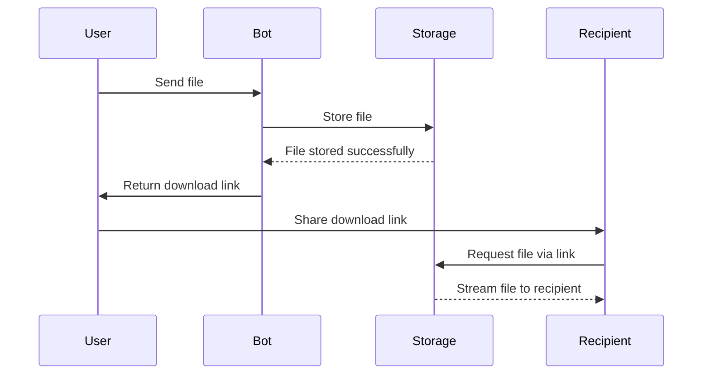

# Introduction to StreamBot

StreamBot is a powerful Telegram bot that generates direct download links for files sent to it. It allows you to share files of any size through Telegram, providing recipients with direct download links that don't require a Telegram account to access.

## What StreamBot Does

StreamBot solves a common problem: sharing large files through Telegram in a way that anyone can access them. When you send a file to StreamBot, it:

1. Processes the file securely
2. Stores it using Telegram's infrastructure
3. Generates a direct download link
4. Manages bandwidth and download limits
5. Tracks usage statistics

## Key Benefits

- :material-rocket-launch:{ .lg .middle } **High Performance**

    ---

    Multi-client architecture ensures fast processing and downloads even under heavy load.

- :material-shield-lock:{ .lg .middle } **Controlled Access**

    ---

    Configure download limits, rate limiting, and optional force subscription for greater control.

- :material-chart-line:{ .lg .middle } **Usage Monitoring**

    ---

    Track bandwidth usage, user statistics, and system performance in real-time.

- :material-api:{ .lg .middle } **API Integration**

    ---

    REST API allows integration with your applications and services.

## Who Should Use StreamBot

StreamBot is ideal for:

- **Content Creators** sharing files with audiences
- **Businesses** distributing documents to clients
- **Developers** sharing builds or large code packages
- **Communities** managing file distribution
- **Personal Users** who want simple file sharing with friends and family

## How It Works

## Getting Started

Ready to get started with StreamBot? The next sections will guide you through:

1. [Installation](installation.md) - How to set up StreamBot
2. [Configuration](configuration.md) - Configuring your bot
3. [Quick Start](quick-start.md) - Getting up and running quickly

## Features at a Glance

| Feature | Description |
|---------|-------------|
| Direct Download Links | Generate shareable links for any file |
| Multi-Client Support | Distribute load across multiple Telegram clients |
| Bandwidth Management | Track and limit bandwidth usage |
| Rate Limiting | Control access frequency per user |
| Force Subscription | Require users to join channels before using the bot |
| Admin Commands | Monitor and manage the bot via Telegram |
| REST API | Integrate with your own applications |
| Automatic Cleanup | Maintain system resources efficiently |

## Next Steps

Proceed to the [Installation Guide](installation.md) to set up your own StreamBot instance. 