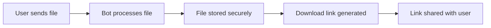

# User Guide Overview

StreamBot is designed to be simple yet powerful. This guide covers all features and how to use them effectively.

## Core Functionality

### File to Link Conversion

StreamBot's primary function is converting files sent via Telegram into direct download links that can be shared with anyone.



### Supported File Types

StreamBot supports all file types that Telegram accepts:

- **Documents**: PDF, DOCX, TXT, ZIP, etc.
- **Images**: JPG, PNG, GIF, WebP, etc.
- **Videos**: MP4, AVI, MKV, etc.
- **Audio**: MP3, FLAC, OGG, etc.
- **Archives**: ZIP, RAR, 7Z, etc.
- **Any other file type** up to Telegram's size limits

## Basic Usage

### Getting Started

1. **Find your bot** on Telegram (search for your bot's username)
2. **Send `/start`** to begin using the bot
3. **Send any file** to generate a download link
4. **Share the link** with anyone who needs access

### File Upload Process

1. **Send a file** to the bot via Telegram
2. **Wait for processing** (usually instant for small files)
3. **Receive download link** in the chat
4. **Copy and share** the link as needed

### Download Links

Generated links have the format:
```
https://yourdomain.com/dl/encoded_file_id/filename.ext
```

- Links are **permanent** (unless expiration is enabled)
- **No Telegram account required** to download
- **Direct downloads** start immediately
- **Range requests supported** for partial downloads

## User Commands

### Basic Commands

| Command | Description | Example |
|---------|-------------|---------|
| `/start` | Welcome message and bot info | `/start` |
| `/help` | Show available commands | `/help` |
| `/info` | Bot statistics and status | `/info` |

### Information Commands

| Command | Description | Access |
|---------|-------------|--------|
| `/stats` | Personal usage statistics | All users |
| `/ping` | Check bot responsiveness | All users |

## Features in Detail

### Rate Limiting

StreamBot implements rate limiting to prevent abuse:

- **Daily limits** on link generation (configurable)
- **Per-user tracking** of usage
- **Automatic reset** at midnight UTC
- **Graceful handling** when limits are reached

!!! info "Rate Limit Reached"
    When you reach your daily limit, the bot will inform you how long until reset.

### Bandwidth Management

Monitor and control data usage:

- **Monthly bandwidth tracking** with automatic reset
- **Global bandwidth limits** (configurable)
- **Real-time usage statistics** via `/stats` command
- **Automatic cleanup** of old usage data (keeps 3 months)
- **Protected current month data** - cleanup never affects current month
- **Efficient stream tracking** with automatic cleanup of stale connections

### System Management

Automated cleanup and monitoring:

- **Stream cleanup** runs every 10 minutes to remove stale connections
- **Memory cleanup** runs hourly to optimize resource usage  
- **Bandwidth cleanup** runs daily to remove old records
- **Maximum stream age** of 4 hours for large file downloads
- **Accurate stream counting** prevents resource leaks

### Force Subscription

If enabled, users must join specified channels before using the bot:

- **Channel verification** before each use
- **Automatic checking** of membership status
- **Graceful prompts** to join required channels
- **Multiple channels** can be required

### Link Expiration

Optional link expiration for enhanced security:

- **Configurable expiration time** (default: 24 hours)
- **Automatic cleanup** of expired links
- **Clear expiration notices** in generated links
- **Can be disabled** for permanent links

## Admin Features

### Admin Commands

| Command | Description | Usage |
|---------|-------------|-------|
| `/stats` | System statistics with memory, streams, and bandwidth | `/stats` |
| `/logs` | View application logs | `/logs level=ERROR limit=50` |
| `/broadcast` | Send message to all users | Reply to message with `/broadcast` |

### Log Access

Admins can access detailed logs:

```
/logs level=INFO limit=100
/logs level=ERROR limit=50
/logs filter=download
```

**Log Levels**: `DEBUG`, `INFO`, `WARNING`, `ERROR`, `CRITICAL`

### Broadcasting

Send announcements to all bot users:

1. **Compose your message** in Telegram
2. **Reply to it** with `/broadcast`
3. **Confirm** when prompted
4. **Message sent** to all users

### Memory Monitoring

Track system resource usage:

- **Current memory usage**
- **Peak memory usage**
- **Active connections**
- **Garbage collection stats**

## API Access

### Public Endpoints

Anyone can access these endpoints:

| Endpoint | Description |
|----------|-------------|
| `GET /api/info` | Bot status and public information |
| `GET /dl/{file_id}` | Download files via generated links |

### Admin Endpoints

Require authentication:

| Endpoint | Description | Authentication |
|----------|-------------|---------------|
| `GET /api/logs` | Access application logs | Token + IP whitelist |

### Example API Usage

```bash
# Get bot information
curl https://yourdomain.com/api/info

# Download a file
curl -O https://yourdomain.com/dl/encoded_file_id/filename.pdf

# Access logs (admin only)
curl "https://yourdomain.com/api/logs?token=your_token&level=ERROR&limit=50"
```

## Troubleshooting

### Common Issues

!!! question "Bot doesn't respond to commands"
    **Possible causes:**
    - Bot is offline or restarting
    - You're not in a private chat with the bot
    - Bot is experiencing high load
    
    **Solutions:**
    - Wait a few minutes and try again
    - Check bot status at `/api/info`
    - Contact administrator

!!! question "File upload fails"
    **Possible causes:**
    - File too large (>2GB for Telegram)
    - Rate limit reached
    - Bandwidth limit exceeded
    - Bot storage issues
    
    **Solutions:**
    - Check file size limits
    - Wait for rate limit reset
    - Try again later
    - Contact administrator if persistent

!!! question "Download links don't work"
    **Possible causes:**
    - Link has expired
    - Server is down
    - Network connectivity issues
    - File was removed
    
    **Solutions:**
    - Generate a new link
    - Check server status
    - Try from different network
    - Contact administrator

!!! question "Can't access admin features"
    **Possible causes:**
    - Not configured as admin
    - IP address not whitelisted
    - Invalid access token
    
    **Solutions:**
    - Check admin configuration
    - Verify IP whitelist
    - Update access tokens

### Error Messages

| Error | Meaning | Solution |
|-------|---------|----------|
| "Rate limit exceeded" | Too many requests | Wait for reset time |
| "File too large" | Exceeds size limits | Use smaller file |
| "Bandwidth exceeded" | Monthly limit reached | Wait for monthly reset |
| "Join required channels" | Subscription required | Join specified channels |
| "Link expired" | Download link invalid | Generate new link |

### Getting Support

If you need help:

1. **Check this documentation** for common solutions
2. **Review error messages** carefully
3. **Test with different files** to isolate issues
4. **Contact administrators** via configured support channels
5. **Report bugs** on GitHub Issues (if applicable)

## Best Practices

### For Users

- **Use descriptive filenames** for better organization
- **Check file sizes** before uploading large files
- **Share links responsibly** and only with intended recipients
- **Monitor your usage** to avoid hitting limits
- **Keep download links secure** if they contain sensitive content

### For Administrators

- **Set appropriate limits** based on your server capacity
- **Monitor system resources** regularly
- **Keep software updated** for security and features
- **Backup configuration** and database regularly
- **Review logs** for unusual activity

## Advanced Usage

### Multiple File Sharing

For sharing multiple files:

1. **Create an archive** (ZIP, RAR, etc.) containing all files
2. **Upload the archive** to get a single download link
3. **Share the archive link** instead of multiple individual links

### Integration with Applications

Use the API to integrate StreamBot with your applications:

- **Automated file sharing** for your services
- **Programmatic link generation** via API calls
- **Status monitoring** for system health
- **Log analysis** for usage patterns

This completes the user guide overview. For specific features, see the dedicated sections in this guide. 